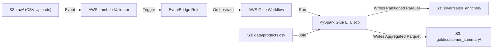

# Enterprise Hybrid Data Pipeline (Medallion S3 Architecture)

A 100% serverless, AWS Free Tier-compliant Medallion Data Lake Architecture built with Terraform, AWS Lambda, EventBridge, and AWS Glue (PySpark).

## Architecture Overview



## Medallion Layers

* **Raw Layer** (`s3://.../raw/`): Unprocessed incoming sales CSV files.
* **Silver Layer** (`s3://.../silver/sales_enriched/`): Cleaned, schema-enforced, left-joined sales data with product metadata in Snappy Parquet format, partitioned by `status`.
* **Gold Layer** (`s3://.../gold/customer_summary/`): Aggregated customer sales summaries (`total_orders`, `total_spent`, `avg_order_value`) in Snappy Parquet format.

## Deployment & Setup

1. **Initialize Git**:
   ```bash
   git init
   git add .
   git commit -m "initial commit for enterprise hybrid pipeline"
   ```

2. **Deploy with Terraform**:
   ```bash
   terraform init
   terraform apply -auto-approve
   ```
